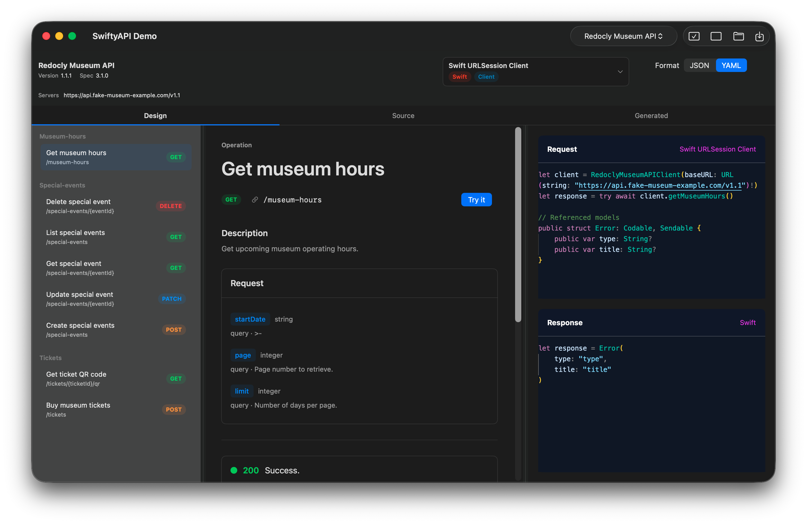

# SwiftyAPI

SwiftyAPI is a SwiftUI framework for viewing, editing, and generating code from OpenAPI and Swagger documents. It provides a drop-in `SwiftyAPIView` that can render an API in a documentation-style designer, edit the original YAML or JSON source, and preview generated client or server code.

The package also includes `SwiftyAPIDemo`, a macOS app that demonstrates the framework with bundled OpenAPI samples.

## Screenshots




## Features

- Drop-in SwiftUI `SwiftyAPIView`
- OpenAPI source editing for `.yaml`, `.yml`, and `.json`
- Design view with operation navigation, request details, response details, and generated request/response examples
- Generated-code view for full client or server output
- Monaco-powered source and generated-code editors on macOS
- Built-in generators for cURL, Swift, TypeScript, Python, and .NET/C#
- Runtime JavaScript generator support through JavaScriptCore
- Demo app generated with XcodeGen and configured to run locally on macOS

## Requirements

- Swift 6.0+
- macOS 14+ for the demo app
- iOS 17+ for the framework target
- XcodeGen if you want to regenerate the included Xcode project

## Installation

Add SwiftyAPI to your app with Swift Package Manager.

In Xcode:

1. Open your project.
2. Choose `File > Add Package Dependencies`.
3. Enter the SwiftyAPI repository URL.
4. Add the `SwiftyAPI` library product to your app target.

In `Package.swift`:

```swift
dependencies: [
    .package(url: "https://github.com/your-org/SwiftyAPI.git", branch: "main")
],
targets: [
    .target(
        name: "YourApp",
        dependencies: ["SwiftyAPI"]
    )
]
```

Replace the URL with your repository location when publishing the package.

## Quick Start

```swift
import SwiftUI
import SwiftyAPI

struct ContentView: View {
    @State private var source = """
    openapi: 3.0.3
    info:
      title: Example API
      version: 1.0.0
    paths: {}
    """

    var body: some View {
        SwiftyAPIView(source: source, format: .yaml) { document in
            // React to parsed document changes.
            print(document.summary.title)
        }
    }
}
```

`SwiftyAPIView` opens to the design view by default. The source tab lets users edit the OpenAPI document, and the generated tab displays full generator output for the selected generator.

## Built-In Generators

SwiftyAPI includes generators for:

- cURL examples
- Swift URLSession client
- Swift Vapor server
- TypeScript Axios client
- TypeScript Node server
- Python httpx client
- Python FastAPI server
- .NET HttpClient client
- ASP.NET Minimal API server

Generators conform to `SwiftyAPICodeGenerator`. Each generator can produce:

- Full generated files through `generateFull`
- Per-operation request and response examples through `generateMethod`

JavaScript generator plugins can be hosted through `SwiftyAPIJavaScriptCoreGenerator`, which provides a runtime extension path without recompiling the framework.

See [Writing a SwiftyAPI Generator Plugin](userDocs/WritingAPlugin.md) for the plugin contract and registration flow. A commented JavaScript Axios example is available in [Examples/Plugins/javascript-axios-client](Examples/Plugins/javascript-axios-client).

## Demo App

The demo app lives in the same package and can be launched from SwiftPM:

```bash
swift run SwiftyAPIDemo
```

To regenerate and build the Xcode project:

```bash
xcodegen generate
xcodebuild -project SwiftyAPI.xcodeproj -scheme SwiftyAPIDemo -destination platform=macOS build
```

The generated Xcode project uses local ad-hoc signing, so it should build and run on macOS without a paid developer team.

## Command Line

The package includes a small generator executable:

```bash
swift run swiftyapi-generate path/to/openapi.yaml
```

It accepts OpenAPI documents in JSON, YAML, or YML form.

## Development

Useful commands:

```bash
swift build
swift test
xcodegen generate
xcodebuild -project SwiftyAPI.xcodeproj -scheme SwiftyAPIDemo -destination platform=macOS build
```

The generated Xcode project is checked in for convenience, but `project.yml` is the source of truth.

## License

SwiftyAPI is available under the MIT License. See [LICENSE](LICENSE).
